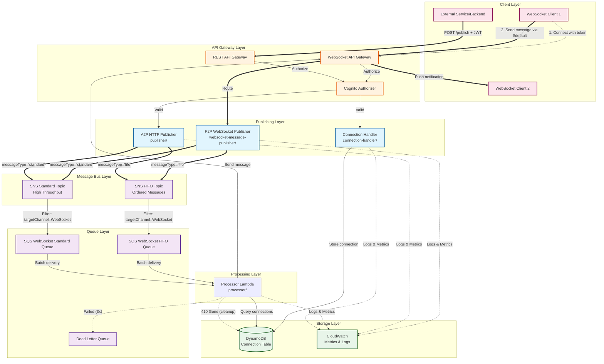

# WebSocket Notification Service - Architecture Overview

## Architecture Diagram



### Legend
- **Solid arrows (==>)**: Primary message flow
- **Dashed arrows (-.-&gt;)**: Secondary operations (auth, logging, cleanup)
- **Blue**: Publishing components
- **Purple**: Message queues and topics
- **Green**: Storage and monitoring
- **Orange**: API Gateway layer
- **Pink**: Client layer

## Two Publishing Approaches

This service supports two distinct approaches for publishing messages to the notification system, each optimized for different use cases.

---

## 📱 P2P (Person-to-Person) - WebSocket Publishing

### Lambda Function
- **Name**: `p2pWebSocketPublisher`
- **Location**: `websocket-message-publisher/`
- **Route**: WebSocket `$default` route

### Use Cases
- Real-time user-to-user messaging
- Interactive chat applications
- Low-latency notifications between users
- Client-initiated broadcasts

### Architecture Flow
```
WebSocket Client 
    ↓ (persistent connection)
WebSocket API Gateway ($default route)
    ↓
P2P WebSocket Publisher Lambda
    ↓
SNS Topic (FIFO or Standard)
    ↓
SQS Queue (WebSocket FIFO/Standard)
    ↓
Processor Lambda
    ↓
WebSocket API (send to target connections)
    ↓
Target WebSocket Clients
```

### Key Advantages
✅ **Lower Latency** (~50-200ms reduction)
  - No HTTP request/response overhead
  - Reuses persistent WebSocket connection
  - Single protocol layer (WebSocket frames only)

✅ **Bidirectional Communication**
  - Same connection for sending and receiving
  - Real-time feedback on message delivery

✅ **Automatic Authentication**
  - User identity extracted from WebSocket context
  - No need to pass auth token per message

✅ **Connection Efficiency**
  - One persistent connection handles multiple messages
  - Reduced connection overhead

### Message Format
```json
{
  "action": "sendMessage",
  "targetChannel": "WebSocket",
  "messageType": "standard",
  "payload": {
    "targetId": "user-456",
    "targetClass": "user",
    "eventType": "chat",
    "content": "Hello!"
  }
}
```

### Authentication
- Token provided once during WebSocket connection establishment
- User ID automatically extracted from authorizer context
- No per-message authentication required

---

## 🌐 A2P (Application-to-Person) - HTTP REST API Publishing

### Lambda Function
- **Name**: `a2pHttpPublisher`
- **Location**: `publisher/`
- **Endpoint**: `POST /publish`

### Use Cases
- Backend service integrations
- Scheduled notifications
- Third-party application messaging
- Server-to-user notifications
- Batch processing systems

### Architecture Flow
```
External Service / Backend
    ↓ (HTTPS POST request)
REST API Gateway (/publish endpoint)
    ↓ (Cognito authorization)
A2P HTTP Publisher Lambda
    ↓
SNS Topic (FIFO or Standard)
    ↓
SQS Queue (WebSocket FIFO/Standard)
    ↓
Processor Lambda
    ↓
WebSocket API (send to target connections)
    ↓
Target WebSocket Clients
```

### Key Advantages
✅ **Service Integration**
  - Easy integration from any HTTP-capable system
  - Standard REST API interface
  - No WebSocket connection required

✅ **Stateless**
  - Each request is independent
  - No connection management needed

✅ **Batch Support**
  - Can send multiple notifications in sequence
  - Better for scheduled/automated tasks

✅ **Cross-Platform**
  - Works from any backend language/framework
  - Standard HTTP tooling

### Message Format
```json
{
  "targetChannel": "WebSocket",
  "messageType": "fifo",
  "payload": {
    "targetId": "user-123",
    "targetClass": "user",
    "eventType": "notification",
    "content": "Your order has shipped!"
  }
}
```

### Authentication
- Cognito JWT token in `Authorization` header
- Token validated per request
- User ID extracted from token claims

---

## 📊 Detailed Comparison

| Aspect | P2P (WebSocket) | A2P (HTTP REST) |
|--------|-----------------|-----------------|
| **Lambda** | `p2pWebSocketPublisher` | `a2pHttpPublisher` |
| **Trigger** | WebSocket `$default` route | API Gateway `/publish` POST |
| **Latency** | ~100-300ms | ~200-500ms |
| **Protocol Overhead** | WebSocket frames only | HTTP + WebSocket frames |
| **Connection Type** | Persistent, bidirectional | Request/response |
| **Auth Method** | Context from connection | JWT per request |
| **Best For** | User-to-user messaging | Service-to-user notifications |
| **Client Type** | WebSocket-capable clients | Any HTTP client |
| **State** | Stateful connection | Stateless requests |
| **Typical Use** | Chat, real-time updates | Alerts, scheduled jobs |
| **Complexity** | Higher (connection mgmt) | Lower (simple HTTP) |
| **Scalability** | Limited by connections | Unlimited requests |
| **Message Overhead** | Minimal | HTTP headers per request |
| **Response** | Via WebSocket message | HTTP response |
| **Batch Support** | Sequential over connection | Better suited |
| **Error Handling** | Connection-aware | Request-aware |

---

## 🎯 When to Use Each Approach

### Use P2P (WebSocket) When:
- ✅ Building real-time chat applications
- ✅ User is already connected via WebSocket
- ✅ Low latency is critical (gaming, live updates)
- ✅ Need bidirectional communication
- ✅ Frequent messages from same user
- ✅ Building interactive features

### Use A2P (HTTP REST) When:
- ✅ Integrating backend services
- ✅ Sender doesn't maintain WebSocket connection
- ✅ Scheduled/automated notifications
- ✅ Third-party integrations
- ✅ Batch processing requirements
- ✅ Stateless service architecture

---

## 🔧 Implementation Details

### Shared Components
Both approaches use the same downstream infrastructure:

1. **SNS Topics**: FIFO and Standard
2. **SQS Queues**: WebSocket FIFO and Standard queues
3. **Processor Lambda**: Sends messages to target connections
4. **DynamoDB**: Connection management
5. **CloudWatch**: Monitoring and alarms

### Environment Variables

**P2P WebSocket Publisher**:
```javascript
{
  FIFO_TOPIC_ARN: 'arn:aws:sns:...:Notifications.fifo',
  STANDARD_TOPIC_ARN: 'arn:aws:sns:...:Notification'
}
```

**A2P HTTP Publisher**:
```javascript
{
  FIFO_TOPIC_ARN: 'arn:aws:sns:...:Notifications.fifo',
  STANDARD_TOPIC_ARN: 'arn:aws:sns:...:Notification'
}
```

### Message Type Selection

Both approaches support:
- **Standard Topic**: High throughput, best-effort delivery (~100-300ms)
- **FIFO Topic**: Ordered delivery, deduplication (~300-500ms)

Selection is made via `messageType` parameter in the message payload.

---

## 🚀 Quick Start Examples

### P2P Example (JavaScript/TypeScript)
```typescript
// Establish WebSocket connection
const ws = new WebSocket(
  `wss://api.example.com/dvl?token=${token}&userId=${userId}&hubId=${hubId}&orgId=${orgId}`
);

// Send message when connected
ws.onopen = () => {
  ws.send(JSON.stringify({
    action: 'sendMessage',
    targetChannel: 'WebSocket',
    messageType: 'standard',
    payload: {
      targetId: 'user-456',
      targetClass: 'user',
      eventType: 'chat',
      content: 'Hello via P2P!'
    }
  }));
};

// Receive response
ws.onmessage = (event) => {
  const response = JSON.parse(event.data);
  console.log('Message sent:', response.messageId);
};
```

### A2P Example (cURL)
```bash
curl -X POST https://api.example.com/dvl/publish \
  -H "Authorization: Bearer ${COGNITO_TOKEN}" \
  -H "Content-Type: application/json" \
  -d '{
    "targetChannel": "WebSocket",
    "messageType": "fifo",
    "payload": {
      "targetId": "user-123",
      "targetClass": "user",
      "eventType": "notification",
      "content": "Message from service"
    }
  }'
```

### A2P Example (Node.js)
```javascript
const response = await fetch('https://api.example.com/dvl/publish', {
  method: 'POST',
  headers: {
    'Authorization': `Bearer ${cognitoToken}`,
    'Content-Type': 'application/json'
  },
  body: JSON.stringify({
    targetChannel: 'WebSocket',
    messageType: 'standard',
    payload: {
      targetId: 'org-789',
      targetClass: 'org',
      eventType: 'announcement',
      content: 'System maintenance tonight'
    }
  })
});

const result = await response.json();
console.log('Message ID:', result.messageId);
```

---

## 📈 Performance Considerations

### Latency Breakdown

**P2P (WebSocket)**:
- WebSocket frame parsing: ~10ms
- Lambda invocation: ~50-100ms
- SNS publish: ~20-50ms
- SQS delivery: ~10-30ms
- Processor Lambda: ~50-100ms
- WebSocket send: ~20-50ms
- **Total: ~160-340ms**

**A2P (HTTP REST)**:
- HTTP request parsing: ~20ms
- API Gateway: ~30-50ms
- Lambda invocation: ~50-100ms
- SNS publish: ~20-50ms
- SQS delivery: ~10-30ms
- Processor Lambda: ~50-100ms
- WebSocket send: ~20-50ms
- **Total: ~200-400ms**

### Throughput

- **P2P**: Limited by active WebSocket connections (~10,000 concurrent)
- **A2P**: Virtually unlimited (API Gateway scales automatically)

---

## 🔍 Monitoring

Both approaches are monitored through:
- **CloudWatch Dashboard**: `WebSocketNotificationService-Latency`
- **Metrics**: Message latency (p50, p95, p99), error rates
- **Alarms**: Average latency, P95 latency, high latency count
- **Logs**: Structured JSON logs with correlation IDs

---

## 🛡️ Security

### P2P (WebSocket)
- Token validated once during connection
- User identity stored in connection context
- Connection-scoped authorization

### A2P (HTTP REST)
- Cognito User Pool authorization
- JWT token validated per request
- Request-scoped authorization

---

## 📚 Further Reading

- [P2P Usage Guide](websocket-message-publisher/USAGE.md)
- [A2P Usage Guide](publisher/USAGE.md)
- [Publisher Grouping Guide](publisher/GROUPING_GUIDE.md)