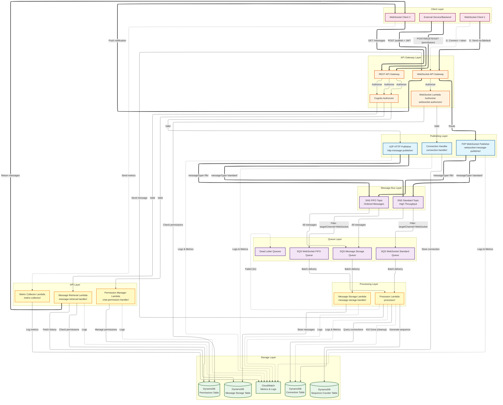

# WebSocket Notification Service - Architecture Overview

## Architecture Diagram



### Legend
- **Solid arrows (==>)**: Primary message flow
- **Dashed arrows (-.-&gt;)**: Secondary operations (auth, logging, cleanup, metrics)
- **Blue**: Publishing components
- **Purple**: Message queues and topics
- **Green**: Storage and monitoring
- **Orange**: API Gateway layer
- **Pink**: Client layer
- **Yellow**: API processing layer

## Core Components

### 1. Message Publishing

The service supports two methods for publishing messages, both following the same downstream processing flow.

#### Publishing Methods

**P2P (Person-to-Person) - WebSocket Publishing**
- **Lambda**: `p2pWebSocketPublisher`
- **Location**: `websocket-message-publisher/`
- **Route**: WebSocket `$default` route
- **Authentication**: Token provided during WebSocket connection, user context from authorizer
- **Protocol**: WebSocket frames over persistent connection

**A2P (Application-to-Person) - HTTP REST Publishing**
- **Lambda**: `a2pHttpPublisher`
- **Location**: `http-message-publisher/`
- **Endpoint**: `POST /publish`
- **Authentication**: Cognito JWT token in `Authorization` header per request
- **Protocol**: HTTPS request/response

#### Unified Message Flow

Both methods follow the same processing pipeline:

```
1. Message Entry:
   - P2P: WebSocket Client → WebSocket API Gateway → P2P Lambda
   - A2P: HTTP Client → REST API Gateway → A2P Lambda

2. Message Distribution:
   Publisher Lambda → SNS Topic (FIFO or Standard)

3. Queue Routing:
   SNS → SQS Queue (WebSocket FIFO/Standard)
   SNS → SQS Storage Queue (all messages)

4. Processing:
   SQS → Processor Lambda (generates sequences for FIFO)

5. Delivery:
   Processor → WebSocket API → Target Clients

6. Storage:
   Storage Queue → Storage Lambda → DynamoDB (30 days)
```

#### Message Format

**P2P (WebSocket):**
```json
{
  "action": "sendMessage",
  "targetChannel": "WebSocket",
  "messageType": "standard",
  "payload": {
    "chatId": "chat-abc123",
    "eventType": "chat",
    "content": "Hello!",
    "requestSequence": true
  }
}
```

**A2P (HTTP):**
```json
{
  "targetChannel": "WebSocket",
  "messageType": "fifo",
  "payload": {
    "chatId": "chat-abc123",
    "eventType": "notification",
    "content": "Your order has shipped!",
    "requestSequence": true
  }
}
```

**Note**: FIFO messages automatically include `requestSequence: true`

#### Comparison

| Aspect | P2P (WebSocket) | A2P (HTTP REST) |
|--------|-----------------|-----------------|
| **Connection** | Persistent, bidirectional | Stateless request/response |
| **Auth** | Once at connection | Per request |
| **Protocol** | WebSocket frames | HTTP + headers |
| **State** | Stateful | Stateless |
| **Best For** | User-to-user messaging, real-time chat | Backend services, scheduled notifications |
| **Client Type** | WebSocket-capable | Any HTTP client |

---

### 2. Message Storage & Retrieval

**Storage Lambda**
- **Location**: `message-storage-handler/`
- **Trigger**: SQS Message Storage Queue (subscribed to both SNS topics)
- **Function**: Stores all messages in DynamoDB with 30-day TTL

**Storage Table (DynamoDB)**
- **Primary Key**: `chatId` (partition), `timestamp` (sort)
- **GSI**: `SequenceIndex` (chatId + sequenceNumber) for gap detection
- **TTL**: 30 days automatic deletion

**Retrieval Lambda**
- **Location**: `message-retrieval-handler/`
- **Endpoint**: `GET /messages`
- **Query Parameters**:
  - `chatId` (required): Target chat ID
  - `limit` (optional): Number of messages (default: 50)
  - `startKey` (optional): Pagination token
  - `fromTimestamp` / `toTimestamp` (optional): Time range filter
- **Authorization**: Cognito User Pool + permission validation
- **Features**: Historical messages, pagination, time-range filtering

---

### 3. Permission Management

**Permissions Table (DynamoDB)**
- **Table**: `UserChatPermissions`
- **Primary Key**: `userId` (partition), `chatId` (sort)
- **GSI**: `ChatIdIndex` (chatId + userId) for reverse lookup
- **Purpose**: Controls user access to specific chats

**Permission Manager Lambda**
- **Location**: `chat-permission-handler/`
- **Endpoints**:
  - `POST /permissions` - Grant chat access
  - `DELETE /permissions` - Revoke chat access
  - `GET /permissions` - List permissions
- **Authorization**: Cognito User Pool

**WebSocket Authorizer**
- **Lambda**: `websocket-authorizer/`
- **Type**: Lambda Request Authorizer
- **Function**: Validates Cognito JWT token and checks chat permissions
- **Returns**: IAM policy + user context (userId, chatIds)

---

### 4. Metrics Collection

**Metric Collector Lambda**
- **Location**: `metric-collector/`
- **Endpoint**: `POST /metrics`
- **Purpose**: Collects client-side performance metrics
- **Authorization**: Cognito User Pool

---

### 5. Sequence Number Management

**Sequence Counter Table (DynamoDB)**
- **Primary Key**: `scope` (partition) - typically `chatId`
- **Attribute**: `sequence` (NUMBER) - current counter
- **Update Method**: Atomic increment using `UpdateItem` with `ADD`

**Sequence Generation Flow**:
1. Publisher receives message with `requestSequence: true` (auto-included for FIFO)
2. Publisher forwards to SNS (no sequence generation)
3. SNS → SQS FIFO Queue (ordered by message group)
4. **Processor Lambda** generates sequence AFTER FIFO ordering
5. Atomic increment in Sequence Counter Table
6. Attaches `sequenceNumber` to message
7. Delivers to clients with consecutive numbers (1, 2, 3...) for gap detection

**Key Design**: Sequences generated in Processor (after FIFO ordering) ensures consecutive numbers match delivery order.

---

### 6. Connection Management

**Connection Table (DynamoDB)**
- **Primary Key**: `connectionId` (partition)
- **GSI**: `ChatIdIndex` (chatId) for multi-chat routing
- **Attributes**:
  - `userId`: User identifier
  - `chatId`: Primary chat ID
  - `chatIds`: Array of subscribed chat IDs
  - `connectedAt`: Connection timestamp
  - `ttl`: Auto-cleanup for stale connections

**Connection Handler Lambda**
- **Location**: `connection-handler/`
- **Routes**:
  - `$connect`: Stores connection with user/chat metadata
  - `$disconnect`: Removes connection from table
- **Features**: Multi-chat subscription, automatic stale connection cleanup (410 Gone responses)

---

## Implementation Details

### Environment Variables

**P2P WebSocket Publisher**:
```javascript
{
  FIFO_TOPIC_ARN: 'arn:aws:sns:...:Notifications.fifo',
  STANDARD_TOPIC_ARN: 'arn:aws:sns:...:Notification'
}
```

**A2P HTTP Publisher**:
```javascript
{
  FIFO_TOPIC_ARN: 'arn:aws:sns:...:Notifications.fifo',
  STANDARD_TOPIC_ARN: 'arn:aws:sns:...:Notification',
  PERMISSIONS_TABLE: 'UserChatPermissions'
}
```

**Processor Lambda**:
```javascript
{
  CONNECTION_TABLE: 'ConnectionTable',
  SEQUENCE_TABLE: 'SequenceCounterTable',  // Generates sequences here
  WS_API_ENDPOINT: 'https://...'
}
```

**Message Storage Lambda**:
```javascript
{
  MESSAGE_STORAGE_TABLE: 'MessageStorageTable'
}
```

**Message Retrieval Lambda**:
```javascript
{
  MESSAGE_STORAGE_TABLE: 'MessageStorageTable',
  PERMISSIONS_TABLE: 'UserChatPermissions'
}
```

### Message Type Selection

Both P2P and A2P support:
- **Standard Topic**: High throughput, best-effort delivery
- **FIFO Topic**: Ordered delivery with deduplication

Selection via `messageType` parameter in message payload.

---

## Usage Examples

### P2P Example (JavaScript/TypeScript)
```typescript
// Establish WebSocket connection
const ws = new WebSocket(
  `wss://api.example.com/dvl?token=${token}&userId=${userId}&chatId=${chatId}`
);

// Send message
ws.onopen = () => {
  ws.send(JSON.stringify({
    action: 'sendMessage',
    targetChannel: 'WebSocket',
    messageType: 'fifo',
    payload: {
      chatId: 'chat-abc123',
      eventType: 'chat',
      content: 'Hello via P2P!',
      requestSequence: true
    }
  }));
};

// Receive message
ws.onmessage = (event) => {
  const response = JSON.parse(event.data);
  console.log('Message received:', response);
};
```

### A2P Example (cURL)
```bash
curl -X POST https://api.example.com/dvl/publish \
  -H "Authorization: Bearer ${COGNITO_TOKEN}" \
  -H "Content-Type: application/json" \
  -d '{
    "targetChannel": "WebSocket",
    "messageType": "fifo",
    "payload": {
      "chatId": "chat-abc123",
      "eventType": "notification",
      "content": "Message from service",
      "requestSequence": true
    }
  }'
```

### Message Retrieval Example
```bash
# Get recent messages
curl -X GET "https://api.example.com/dvl/messages?chatId=chat-abc123&limit=50" \
  -H "Authorization: Bearer ${COGNITO_TOKEN}"

# With pagination
curl -X GET "https://api.example.com/dvl/messages?chatId=chat-abc123&limit=50&startKey=${KEY}" \
  -H "Authorization: Bearer ${COGNITO_TOKEN}"

# Time range filter
curl -X GET "https://api.example.com/dvl/messages?chatId=chat-abc123&fromTimestamp=2025-10-01T00:00:00Z" \
  -H "Authorization: Bearer ${COGNITO_TOKEN}"
```

### Permission Management Examples
```bash
# Grant permission
curl -X POST https://api.example.com/dvl/permissions \
  -H "Authorization: Bearer ${COGNITO_TOKEN}" \
  -H "Content-Type: application/json" \
  -d '{"userId": "user-123", "chatId": "chat-abc123", "role": "member"}'

# Revoke permission
curl -X DELETE "https://api.example.com/dvl/permissions?userId=user-123&chatId=chat-abc123" \
  -H "Authorization: Bearer ${COGNITO_TOKEN}"

# List permissions
curl -X GET "https://api.example.com/dvl/permissions?userId=user-123" \
  -H "Authorization: Bearer ${COGNITO_TOKEN}"
```

---

## Security

### Authentication & Authorization

**WebSocket Connections**:
1. Client provides Cognito JWT token in query parameter
2. Lambda Request Authorizer validates token
3. Checks user permissions in Permissions Table
4. Returns IAM policy + user context (userId, chatIds)
5. Connection stored with user metadata

**HTTP API Requests**:
1. Client includes JWT in `Authorization` header
2. Cognito User Pool Authorizer validates token
3. Lambda extracts user identity from token claims
4. Permission checks at application level

### Data Protection

- **In Transit**: TLS 1.2+
- **At Rest**: DynamoDB encryption (AWS managed keys)
- **Token Security**: JWT tokens with 1-hour expiration

### Permission Model

**Chat Access Control**:
- User must have permission entry in `UserChatPermissions` table
- Checked during WebSocket connection
- Checked before message retrieval
- Granular per-chat permissions

---

## Infrastructure

### DynamoDB Tables

| Table | Partition Key | Sort Key | GSI | Purpose |
|-------|--------------|----------|-----|---------|
| **ConnectionTable** | connectionId | - | ChatIdIndex | WebSocket connections |
| **MessageStorageTable** | chatId | timestamp | SequenceIndex | Message history (30 days) |
| **UserChatPermissions** | userId | chatId | ChatIdIndex | Access control |
| **SequenceCounterTable** | scope | - | - | Sequence generation |

### SNS Topics & SQS Queues

| Topic | Type | Subscribers |
|-------|------|-------------|
| **Notifications.fifo** | FIFO | WebSocket FIFO Queue, Storage Queue |
| **Notification** | Standard | WebSocket Standard Queue, Storage Queue |

| Queue | Type | Batch Size | Consumer | DLQ |
|-------|------|------------|----------|-----|
| **WebSocketFifoQueue** | FIFO | 1 | Processor | WebSocketFifoDLQ |
| **WebSocketStandardQueue** | Standard | 1 | Processor | WebSocketStandardDLQ |
| **MessageStorageQueue** | Standard | 10 | Storage | - |

### Lambda Functions

| Function | Runtime | Timeout | Concurrency | Notes |
|----------|---------|---------|-------------|-------|
| **websocket-authorizer** | Node.js 22 | 10s | Default | JWT validation |
| **connection-handler** | Node.js 22 | 30s | Default | Connection lifecycle |
| **p2pWebSocketPublisher** | Node.js 22 | 10s | Default | WebSocket publishing |
| **a2pHttpPublisher** | Node.js 22 | 10s | Reserved: 1 | HTTP publishing |
| **processor** | Node.js 22 | 60s | Default | Generates sequences |
| **message-storage** | Node.js 22 | 30s | Reserved: 5 | Batch storage |
| **message-retrieval** | Node.js 22 | 10s | Default | Historical queries |
| **chat-permission** | Node.js 22 | 10s | Default | Permission management |
| **metric-collector** | Node.js 22 | 10s | Default | Metrics collection |

---

## Further Reading

### Component Guides
- [P2P WebSocket Publishing](websocket-message-publisher/USAGE.md)
- [A2P HTTP Publishing](http-message-publisher/USAGE.md)
- [Message Grouping](http-message-publisher/GROUPING_GUIDE.md)
- [Sequence Number Tracking](SEQUENCE_NUMBER_GUIDE.md)
- [Message Retrieval & Pagination](PAGINATION_GUIDE.md)
- [Permission Management](PERMISSIONS_MANAGER_GUIDE.md)

### Getting Started
- [Quick Start](QUICK_START.md)
- [Client Quick Start](CLIENT_QUICK_START.md)
- [Testing Guide](TESTING_GUIDE.md)
- [Deployment Checklist](DEPLOYMENT_CHECKLIST.md)

### Technical Details
- [Message Formats](MESSAGE_FORMATS.md)
- [ChatID GSI Design](CHATID_GSI_DESIGN.md)
- [Sequence Tracking](SEQUENCE_TRACKING_EXPLAINED.md)
- [Authorization Guide](AUTHORIZATION_GUIDE.md)