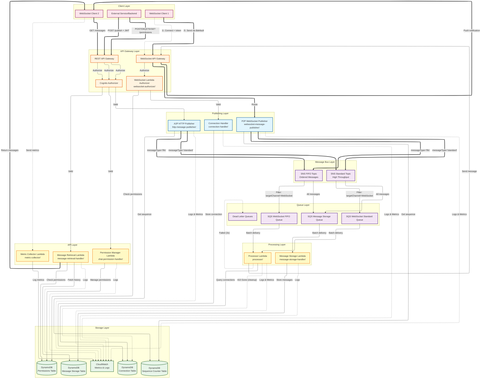

# WebSocket Notification Service - Architecture Overview

## Architecture Diagram



### Legend
- **Solid arrows (==>)**: Primary message flow
- **Dashed arrows (-.-&gt;)**: Secondary operations (auth, logging, cleanup, metrics)
- **Blue**: Publishing components
- **Purple**: Message queues and topics
- **Green**: Storage and monitoring
- **Orange**: API Gateway layer
- **Pink**: Client layer
- **Yellow**: API processing layer

## Core Components

### 1. Message Publishing (Two Approaches)

This service supports two distinct approaches for publishing messages to the notification system, each optimized for different use cases.

---

## 📱 P2P (Person-to-Person) - WebSocket Publishing

### Lambda Function
- **Name**: `p2pWebSocketPublisher`
- **Location**: `websocket-message-publisher/`
- **Route**: WebSocket `$default` route

### Use Cases
- Real-time user-to-user messaging
- Interactive chat applications
- Low-latency notifications between users
- Client-initiated broadcasts

### Architecture Flow
```
WebSocket Client 
    ↓ (persistent connection)
WebSocket API Gateway ($default route)
    ↓
P2P WebSocket Publisher Lambda
    ↓
SNS Topic (FIFO or Standard)
    ↓
SQS Queue (WebSocket FIFO/Standard)
    ↓
Processor Lambda
    ↓
WebSocket API (send to target connections)
    ↓
Target WebSocket Clients
```

### Key Advantages
✅ **Lower Latency** (~50-200ms reduction)
  - No HTTP request/response overhead
  - Reuses persistent WebSocket connection
  - Single protocol layer (WebSocket frames only)

✅ **Bidirectional Communication**
  - Same connection for sending and receiving
  - Real-time feedback on message delivery

✅ **Automatic Authentication**
  - User identity extracted from WebSocket context
  - No need to pass auth token per message

✅ **Connection Efficiency**
  - One persistent connection handles multiple messages
  - Reduced connection overhead

### Message Format
```json
{
  "action": "sendMessage",
  "targetChannel": "WebSocket",
  "messageType": "standard",
  "payload": {
    "chatId": "chat-abc123",
    "eventType": "chat",
    "content": "Hello!"
  }
}
```

### Authentication
- Token provided once during WebSocket connection establishment
- User ID automatically extracted from authorizer context
- Chat permissions validated during connection
- No per-message authentication required

---

## 🌐 A2P (Application-to-Person) - HTTP REST API Publishing

### Lambda Function
- **Name**: `a2pHttpPublisher`
- **Location**: `http-message-publisher/`
- **Endpoint**: `POST /publish`

### Use Cases
- Backend service integrations
- Scheduled notifications
- Third-party application messaging
- Server-to-user notifications
- Batch processing systems

### Architecture Flow
```
External Service / Backend
    ↓ (HTTPS POST request)
REST API Gateway (/publish endpoint)
    ↓ (Cognito authorization)
A2P HTTP Publisher Lambda
    ↓
SNS Topic (FIFO or Standard)
    ↓
SQS Queue (WebSocket FIFO/Standard)
    ↓
Processor Lambda
    ↓
WebSocket API (send to target connections)
    ↓
Target WebSocket Clients
```

### Key Advantages
✅ **Service Integration**
  - Easy integration from any HTTP-capable system
  - Standard REST API interface
  - No WebSocket connection required

✅ **Stateless**
  - Each request is independent
  - No connection management needed

✅ **Batch Support**
  - Can send multiple notifications in sequence
  - Better for scheduled/automated tasks

✅ **Cross-Platform**
  - Works from any backend language/framework
  - Standard HTTP tooling

### Message Format
```json
{
  "targetChannel": "WebSocket",
  "messageType": "fifo",
  "payload": {
    "chatId": "chat-abc123",
    "eventType": "notification",
    "content": "Your order has shipped!"
  }
}
```

### Authentication
- Cognito JWT token in `Authorization` header
- Token validated per request
- User ID extracted from token claims
- Chat permissions checked if applicable

---

## 📊 Detailed Comparison

| Aspect | P2P (WebSocket) | A2P (HTTP REST) |
|--------|-----------------|-----------------|
| **Lambda** | `p2pWebSocketPublisher` | `a2pHttpPublisher` |
| **Trigger** | WebSocket `$default` route | API Gateway `/publish` POST |
| **Latency** | ~100-300ms | ~200-500ms |
| **Protocol Overhead** | WebSocket frames only | HTTP + WebSocket frames |
| **Connection Type** | Persistent, bidirectional | Request/response |
| **Auth Method** | Context from connection | JWT per request |
| **Best For** | User-to-user messaging | Service-to-user notifications |
| **Client Type** | WebSocket-capable clients | Any HTTP client |
| **State** | Stateful connection | Stateless requests |
| **Typical Use** | Chat, real-time updates | Alerts, scheduled jobs |
| **Complexity** | Higher (connection mgmt) | Lower (simple HTTP) |
| **Scalability** | Limited by connections | Unlimited requests |
| **Message Overhead** | Minimal | HTTP headers per request |
| **Response** | Via WebSocket message | HTTP response |
| **Batch Support** | Sequential over connection | Better suited |
| **Error Handling** | Connection-aware | Request-aware |

---

## 🗄️ Message Storage & Retrieval

### Message Storage Lambda
- **Location**: `message-storage-handler/`
- **Purpose**: Persistently stores all messages for 30 days
- **Trigger**: SQS Message Storage Queue (subscribed to both SNS topics)

### Message Storage Table (DynamoDB)
- **Partition Key**: `chatId` (STRING)
- **Sort Key**: `timestamp` (STRING)
- **GSI**: `SequenceIndex` (chatId + sequenceNumber) for gap detection
- **TTL**: 30 days automatic deletion
- **Features**:
  - Full message history per chat
  - Efficient pagination support
  - Sequence number tracking

### Message Retrieval Lambda
- **Location**: `message-retrieval-handler/`
- **Endpoint**: `GET /messages`
- **Query Parameters**:
  - `chatId` (required): Chat ID to retrieve messages from
  - `limit` (optional): Number of messages to return (default: 50)
  - `startKey` (optional): Pagination token
  - `fromTimestamp` (optional): Filter messages after this timestamp
  - `toTimestamp` (optional): Filter messages before this timestamp
- **Authorization**: Cognito User Pool + permission check
- **Features**:
  - Retrieves historical messages
  - Permission-based access control
  - Pagination support
  - Time-range filtering

---

## 🔐 Permission Management System

### User Chat Permissions Table (DynamoDB)
- **Table Name**: `UserChatPermissions`
- **Partition Key**: `userId` (STRING)
- **Sort Key**: `chatId` (STRING)
- **GSI**: `ChatIdIndex` (chatId + userId) for reverse lookup
- **Purpose**: Manages user access to specific chats

### Permission Manager Lambda
- **Location**: `chat-permission-handler/`
- **Endpoints**:
  - `POST /permissions` - Grant user permission to a chat
  - `DELETE /permissions` - Revoke user permission from a chat
  - `GET /permissions` - List user's chat permissions
- **Authorization**: Cognito User Pool
- **Features**:
  - Grant/revoke chat access
  - List user permissions
  - Reverse lookup (users per chat)

### WebSocket Authorization
- **Lambda**: `websocket-authorizer/`
- **Type**: Lambda Request Authorizer
- **Validates**:
  - Cognito JWT token (from query parameter)
  - User permission to access requested chat IDs
- **Returns**: IAM policy + user context (userId, chatIds)

---

## 📈 Monitoring & Metrics

### Metric Collector Lambda
- **Location**: `metric-collector/`
- **Endpoint**: `POST /metrics`
- **Purpose**: Collects client-side performance metrics
- **Metrics Collected**:
  - **End-to-End Latency**: Publisher → Client total time
  - **Network Latency**: Processor → Client delivery time
  - **Jitter**: Latency variance between consecutive messages
- **Authorization**: Cognito User Pool

### CloudWatch Dashboard
- **Name**: `NotificationService-Latency`
- **Widgets**:
  1. **End-to-End Latency Percentiles** (P50, P90, P95, P99)
  2. **Latency Breakdown**: Publisher→Processor vs Processor→Client
  3. **Average & Extremes**: Avg, Min, Max latencies
  4. **Publisher→Processor Percentiles**: Internal system latency
  5. **Network Latency Percentiles**: WebSocket delivery time
  6. **Jitter Analysis**: Latency variance
  7. **Message Throughput**: Total messages + high latency count

### Metric Filters
- **PublisherToProcessorLatency**: Measures SNS→SQS→Lambda time
- **ClientEndToEndLatency**: Measures Publisher→Client total time
- **ClientNetworkLatency**: Measures Processor→Client delivery time
- **ClientJitter**: Measures latency variance
- **HighLatencyMessageCount**: Counts messages exceeding 1000ms

---

## 🔢 Sequence Number Management

### Sequence Counter Table (DynamoDB)
- **Partition Key**: `scope` (STRING) - e.g., "chat:{chatId}"
- **Attributes**: 
  - `currentSequence` (NUMBER): Current sequence counter
- **Purpose**: Generates consecutive sequence numbers per chat
- **Update Method**: Atomic increment using `UpdateItem` with `ADD`

### Sequence Number Flow
1. Publisher Lambda receives message
2. Generates sequence number: `scope = chat:{chatId}`
3. Atomic increment in Sequence Counter Table
4. Attaches sequence number to message
5. Message stored with sequence number in Message Storage Table
6. Clients can detect gaps using sequence numbers

---

## 🔄 Connection Management

### Connection Table (DynamoDB)
- **Partition Key**: `connectionId` (STRING)
- **GSI**: `ChatIdIndex` (chatId) - for multi-chat routing
- **Attributes**:
  - `userId`: User identifier
  - `chatId`: Primary chat ID (stored as attribute)
  - `chatIds`: Array of all subscribed chat IDs
  - `connectedAt`: Connection timestamp
  - `ttl`: Auto-cleanup for stale connections

### Connection Handler Lambda
- **Location**: `connection-handler/`
- **Routes**:
  - `$connect`: Stores connection with user/chat metadata
  - `$disconnect`: Removes connection from table
- **Features**:
  - Multi-chat subscription support
  - Automatic stale connection cleanup (410 Gone responses)
  - User context from authorizer

---

## 📊 Detailed Comparison

| Aspect | P2P (WebSocket) | A2P (HTTP REST) |
|--------|-----------------|-----------------|
| **Lambda** | `p2pWebSocketPublisher` | `a2pHttpPublisher` |
| **Trigger** | WebSocket `$default` route | API Gateway `/publish` POST |
| **Latency** | ~100-300ms | ~200-500ms |
| **Protocol Overhead** | WebSocket frames only | HTTP + WebSocket frames |
| **Connection Type** | Persistent, bidirectional | Request/response |
| **Auth Method** | Context from connection | JWT per request |
| **Best For** | User-to-user messaging | Service-to-user notifications |
| **Client Type** | WebSocket-capable clients | Any HTTP client |
| **State** | Stateful connection | Stateless requests |
| **Typical Use** | Chat, real-time updates | Alerts, scheduled jobs |
| **Complexity** | Higher (connection mgmt) | Lower (simple HTTP) |
| **Scalability** | Limited by connections | Unlimited requests |
| **Message Overhead** | Minimal | HTTP headers per request |
| **Response** | Via WebSocket message | HTTP response |
| **Batch Support** | Sequential over connection | Better suited |
| **Error Handling** | Connection-aware | Request-aware |

---

## 🎯 When to Use Each Approach

### Use P2P (WebSocket) When:
- ✅ Building real-time chat applications
- ✅ User is already connected via WebSocket
- ✅ Low latency is critical (gaming, live updates)
- ✅ Need bidirectional communication
- ✅ Frequent messages from same user
- ✅ Building interactive features

### Use A2P (HTTP REST) When:
- ✅ Integrating backend services
- ✅ Sender doesn't maintain WebSocket connection
- ✅ Scheduled/automated notifications
- ✅ Third-party integrations
- ✅ Batch processing requirements
- ✅ Stateless service architecture

---

## 🔧 Implementation Details

### Shared Components
Both approaches use the same downstream infrastructure:

1. **SNS Topics**: FIFO and Standard
2. **SQS Queues**: WebSocket FIFO and Standard queues
3. **Processor Lambda**: Sends messages to target connections
4. **DynamoDB**: Connection management
5. **CloudWatch**: Monitoring and alarms

### Environment Variables

**P2P WebSocket Publisher**:
```javascript
{
  FIFO_TOPIC_ARN: 'arn:aws:sns:...:Notifications.fifo',
  STANDARD_TOPIC_ARN: 'arn:aws:sns:...:Notification',
  SEQUENCE_TABLE: 'SequenceCounterTable'
}
```

**A2P HTTP Publisher**:
```javascript
{
  FIFO_TOPIC_ARN: 'arn:aws:sns:...:Notifications.fifo',
  STANDARD_TOPIC_ARN: 'arn:aws:sns:...:Notification',
  SEQUENCE_TABLE: 'SequenceCounterTable'
}
```

**Processor Lambda**:
```javascript
{
  CONNECTION_TABLE: 'ConnectionTable',
  WS_API_ENDPOINT: 'https://...'
}
```

**Message Storage Lambda**:
```javascript
{
  MESSAGE_STORAGE_TABLE: 'MessageStorageTable'
}
```

**Message Retrieval Lambda**:
```javascript
{
  MESSAGE_STORAGE_TABLE: 'MessageStorageTable',
  PERMISSIONS_TABLE: 'UserChatPermissions'
}
```

### Message Type Selection

Both approaches support:
- **Standard Topic**: High throughput, best-effort delivery (~100-300ms)
- **FIFO Topic**: Ordered delivery, deduplication (~300-500ms)

Selection is made via `messageType` parameter in the message payload.

---

## 🚀 Quick Start Examples

### P2P Example (JavaScript/TypeScript)
```typescript
// Establish WebSocket connection with chat IDs
const ws = new WebSocket(
  `wss://api.example.com/dvl?token=${token}&userId=${userId}&chatId=${chatId}`
);

// Send message when connected
ws.onopen = () => {
  ws.send(JSON.stringify({
    action: 'sendMessage',
    targetChannel: 'WebSocket',
    messageType: 'standard',
    payload: {
      chatId: 'chat-abc123',
      eventType: 'chat',
      content: 'Hello via P2P!'
    }
  }));
};

// Receive response
ws.onmessage = (event) => {
  const response = JSON.parse(event.data);
  console.log('Message received:', response);
  
  // Send metrics back to server
  if (response.sequenceNumber) {
    fetch('/api/metrics', {
      method: 'POST',
      headers: {
        'Authorization': `Bearer ${token}`,
        'Content-Type': 'application/json'
      },
      body: JSON.stringify({
        messageId: response.messageId,
        sequenceNumber: response.sequenceNumber,
        chatId: response.chatId,
        clientReceivedAt: Date.now()
      })
    });
  }
};
```

### A2P Example (cURL)
```bash
curl -X POST https://api.example.com/dvl/publish \
  -H "Authorization: Bearer ${COGNITO_TOKEN}" \
  -H "Content-Type: application/json" \
  -d '{
    "targetChannel": "WebSocket",
    "messageType": "fifo",
    "payload": {
      "chatId": "chat-abc123",
      "eventType": "notification",
      "content": "Message from service"
    }
  }'
```

### Message Retrieval Example (cURL)
```bash
# Get recent messages for a chat
curl -X GET "https://api.example.com/dvl/messages?chatId=chat-abc123&limit=50" \
  -H "Authorization: Bearer ${COGNITO_TOKEN}"

# Get messages with pagination
curl -X GET "https://api.example.com/dvl/messages?chatId=chat-abc123&limit=50&startKey=${LAST_EVALUATED_KEY}" \
  -H "Authorization: Bearer ${COGNITO_TOKEN}"

# Get messages in time range
curl -X GET "https://api.example.com/dvl/messages?chatId=chat-abc123&fromTimestamp=2025-10-01T00:00:00Z&toTimestamp=2025-10-16T23:59:59Z" \
  -H "Authorization: Bearer ${COGNITO_TOKEN}"
```

### Permission Management Examples (cURL)
```bash
# Grant user permission to a chat
curl -X POST https://api.example.com/dvl/permissions \
  -H "Authorization: Bearer ${COGNITO_TOKEN}" \
  -H "Content-Type: application/json" \
  -d '{
    "userId": "user-123",
    "chatId": "chat-abc123",
    "role": "member"
  }'

# Revoke user permission
curl -X DELETE "https://api.example.com/dvl/permissions?userId=user-123&chatId=chat-abc123" \
  -H "Authorization: Bearer ${COGNITO_TOKEN}"

# List user's permissions
curl -X GET "https://api.example.com/dvl/permissions?userId=user-123" \
  -H "Authorization: Bearer ${COGNITO_TOKEN}"
```

---

## 📈 Performance Considerations

### Latency Breakdown

**P2P (WebSocket)**:
- WebSocket frame parsing: ~10ms
- Lambda invocation: ~50-100ms
- Sequence number generation: ~5-10ms
- SNS publish: ~20-50ms
- SQS delivery: ~10-30ms
- Processor Lambda: ~50-100ms
- WebSocket send: ~20-50ms
- **Total: ~165-360ms**

**A2P (HTTP REST)**:
- HTTP request parsing: ~20ms
- API Gateway: ~30-50ms
- Lambda invocation: ~50-100ms
- Sequence number generation: ~5-10ms
- SNS publish: ~20-50ms
- SQS delivery: ~10-30ms
- Processor Lambda: ~50-100ms
- WebSocket send: ~20-50ms
- **Total: ~205-420ms**

**Message Storage**:
- SNS → SQS: ~10-30ms
- Storage Lambda: ~30-60ms
- DynamoDB write: ~10-20ms
- **Total: ~50-110ms (parallel to delivery)**

### Throughput

- **P2P**: Limited by active WebSocket connections (~10,000 concurrent)
- **A2P**: Virtually unlimited (API Gateway scales automatically)
- **Processor**: Reserved concurrency of 1 (sequential processing)
- **Message Storage**: Reserved concurrency of 5 (parallel batch processing)

### Scalability Considerations

1. **Connection Limits**: 
   - WebSocket API Gateway: ~10,000 concurrent connections per account
   - Can request AWS limit increase for higher capacity

2. **Lambda Concurrency**:
   - Processor: Limited to 1 for sequential message ordering
   - Publishers: Limited to 1 each to prevent SNS throttling
   - Storage: 5 concurrent executions for batch efficiency

3. **DynamoDB**:
   - All tables use PAY_PER_REQUEST billing mode
   - Auto-scales to handle traffic spikes
   - GSIs provide efficient query patterns

4. **SQS Queues**:
   - FIFO queues: 300 messages/sec per message group
   - Standard queues: Unlimited throughput
   - DLQ for failed message retention

---

## 🔍 Monitoring

The system provides comprehensive monitoring through CloudWatch:

### Metrics Collected

**Server-Side Metrics** (Automatic):
- **PublisherToProcessorLatency**: SNS → SQS → Processor time
- **HighLatencyMessageCount**: Messages exceeding 1000ms
- **Lambda Duration**: Execution time for all Lambdas
- **Lambda Errors**: Failed invocations
- **SQS Metrics**: Queue depth, message age
- **DynamoDB Metrics**: Consumed capacity, throttles

**Client-Side Metrics** (via `/metrics` endpoint):
- **EndToEndLatency**: Publisher → Client total time
- **NetworkLatency**: Processor → Client delivery time
- **Jitter**: Latency variance between consecutive messages

### CloudWatch Dashboard

**Dashboard Name**: `NotificationService-Latency`

**Key Widgets**:
1. **End-to-End Latency Percentiles** (P50, P90, P95, P99) - Primary user experience metric
2. **Latency Breakdown** - Publisher→Processor vs Processor→Client comparison
3. **Average & Extremes** - Avg, Min, Max latencies over time
4. **Publisher→Processor Percentiles** - Internal system latency distribution
5. **Network Latency Percentiles** - WebSocket delivery time distribution
6. **Jitter Analysis** - Latency variance for consistent experience
7. **Message Throughput** - Total messages + high latency count

### Logging Strategy

All Lambdas use **structured JSON logging**:
```json
{
  "timestamp": "2025-10-16T12:00:00.000Z",
  "level": "INFO",
  "event_type": "latency_measurement",
  "messageId": "msg-123",
  "chatId": "chat-abc",
  "sequenceNumber": 42,
  "latency_ms": 245,
  "correlation_id": "corr-xyz"
}
```

### X-Ray Tracing

- Enabled on all Lambda functions
- Traces end-to-end message flow
- Identifies bottlenecks in the pipeline
- Visualizes service dependencies

---

## 🛡️ Security

### Authentication & Authorization

**WebSocket Connections**:
1. Client provides Cognito JWT token in query parameter
2. Lambda Request Authorizer validates token
3. Authorizer checks user permissions in Permissions Table
4. Returns IAM policy + user context (userId, chatIds)
5. Connection stored with user metadata

**HTTP API Requests**:
1. Client includes JWT in `Authorization` header
2. Cognito User Pool Authorizer validates token
3. Lambda extracts user identity from token claims
4. Permission checks performed at application level

### Data Protection

- **In Transit**: All connections use TLS 1.2+
- **At Rest**: DynamoDB encryption at rest (AWS managed keys)
- **Token Security**: JWT tokens with 1-hour expiration
- **Query Parameter Token**: WebSocket limitation (consider encryption for production)

### Permission Model

**Chat Access Control**:
- User must have permission entry in `UserChatPermissions` table
- Checked during WebSocket connection establishment
- Checked before message retrieval
- Granular per-chat permissions

**Message Visibility**:
- Users can only retrieve messages from chats they have permission to access
- Message storage is chat-scoped
- No cross-chat data leakage

---

## 🏗️ Infrastructure

### DynamoDB Tables

| Table | Partition Key | Sort Key | GSIs | Purpose |
|-------|--------------|----------|------|---------|
| **ConnectionTable** | connectionId | - | ChatIdIndex (chatId) | WebSocket connection management |
| **MessageStorageTable** | chatId | timestamp | SequenceIndex (chatId + sequenceNumber) | Message history (30 days) |
| **UserChatPermissions** | userId | chatId | ChatIdIndex (chatId + userId) | Access control |
| **SequenceCounterTable** | scope | - | - | Sequence number generation |

### SNS Topics

| Topic | Type | Purpose | Subscribers |
|-------|------|---------|-------------|
| **Notifications.fifo** | FIFO | Ordered messages | WebSocket FIFO Queue, Storage Queue |
| **Notification** | Standard | High-throughput | WebSocket Standard Queue, Storage Queue |

### SQS Queues

| Queue | Type | Batch Size | Consumer |
|-------|------|------------|----------|
| **WebSocketFifoQueue** | FIFO | 1 | Processor Lambda |
| **WebSocketStandardQueue** | Standard | 1 | Processor Lambda |
| **MessageStorageQueue** | Standard | 10 | Storage Lambda |
| **WebSocketFifoDLQ** | FIFO | - | Manual review |
| **WebSocketStandardDLQ** | Standard | - | Manual review |

### Lambda Functions

| Function | Runtime | Timeout | Concurrency | Tracing |
|----------|---------|---------|-------------|---------|
| **websocket-authorizer** | Node.js 22 | 10s | Default | Active |
| **connection-handler** | Node.js 22 | Default | Default | Disabled |
| **p2pWebSocketPublisher** | Node.js 22 | 10s | 1 | Active |
| **a2pHttpPublisher** | Node.js 22 | 10s | 1 | Active |
| **processor** | Node.js 22 | 60s | 1 | Active |
| **message-storage** | Node.js 22 | 30s | 5 | Disabled |
| **message-retrieval** | Node.js 22 | 10s | Default | Disabled |
| **chat-permission** | Node.js 22 | 10s | Default | Disabled |
| **metric-collector** | Node.js 22 | 10s | Default | Disabled |

---

## 📚 Further Reading

### Component-Specific Guides
- [P2P WebSocket Publishing Usage](websocket-message-publisher/USAGE.md)
- [A2P HTTP Publishing Usage](http-message-publisher/USAGE.md)
- [Message Grouping Guide](http-message-publisher/GROUPING_GUIDE.md)
- [Sequence Number Tracking](SEQUENCE_NUMBER_GUIDE.md)
- [Message Retrieval & Pagination](PAGINATION_GUIDE.md)
- [Permission Management](PERMISSIONS_MANAGER_GUIDE.md)
- [Client Metrics Integration](CLIENT_METRICS_GUIDE.md)

### Testing & Deployment
- [Testing Guide](TESTING_GUIDE.md)
- [Deployment Checklist](DEPLOYMENT_CHECKLIST.md)
- [Quick Start](QUICK_START.md)
- [Client Quick Start](CLIENT_QUICK_START.md)

### Technical Deep Dives
- [ChatID GSI Design](CHATID_GSI_DESIGN.md)
- [Sequence Tracking Explained](SEQUENCE_TRACKING_EXPLAINED.md)
- [E2E Latency Implementation](E2E_LATENCY_IMPLEMENTATION.md)
- [Message Formats](MESSAGE_FORMATS.md)

### Operations
- [Dashboard Guide](DASHBOARD_GUIDE.md)
- [Monitoring Fix](MONITORING_FIX.md)
- [Authorization Guide](AUTHORIZATION_GUIDE.md)