# Complete Message Flow - Sequence Diagram

```mermaid
sequenceDiagram
    participant C as Client (WebSocket/HTTP)
    participant AG as API Gateway + Authorizer
    participant PUB as Publisher Lambda
    participant PERM as Permissions Table
    participant SEQ as Sequence Counter Table
    participant SNS as SNS Topic (Standard/FIFO)
    participant SQS as SQS Queues (WebSocket + Storage)
    participant PROC as Processor Lambda
    participant STORE as Storage Lambda
    participant DDB as DynamoDB (Connections + Messages)
    participant CW as CloudWatch (Metrics)
    participant C2 as Target Clients (WebSocket)

    %% Step 1: Client publishes message
    rect rgb(252, 228, 236)
    Note over C: 1️⃣ Client Layer - Initiate Message
    alt P2P Publishing (WebSocket)
        C->>+AG: Send via WebSocket $default route<br/>action: sendMessage + payload
        Note right of C: Persistent connection<br/>Lower latency (~50-200ms saved)
    else A2P Publishing (HTTP REST)
        C->>+AG: POST /publish + JWT in Header<br/>Content-Type: application/json
        Note right of C: Stateless request<br/>Backend/scheduled jobs
    end
    end

    %% Step 2: Authentication & Routing
    rect rgb(255, 243, 224)
    Note over AG: 2️⃣ API Gateway Layer - Authenticate & Route
    alt WebSocket Connection (P2P)
        AG->>AG: Lambda Request Authorizer
        AG->>AG: Validate JWT from query param
        AG->>PERM: Check hasPermission(userId, chatId)
        PERM-->>AG: Permission result
        alt Permission Granted
            AG->>AG: Store authorizedChatIds in context
            AG->>+PUB: Route to P2P Publisher<br/>Context: userId, authorizedChatIds
        else Permission Denied
            AG-->>C: 403 Forbidden - No chat access
        end
    else HTTP Request (A2P)
        AG->>AG: Cognito User Pool Authorizer
        AG->>AG: Validate JWT from Authorization header
        AG->>+PUB: Route to A2P Publisher<br/>Context: userId from token claims
    end
    end

    %% Step 3: Publisher Processing
    rect rgb(225, 245, 254)
    Note over PUB: 3️⃣ Publishing Layer - Enrich & Authorize
    
    alt P2P Publisher (WebSocket)
        PUB->>PUB: Extract authorizedChatIds from context
        PUB->>PUB: Validate chatId in authorizedChatIds
        alt chatId NOT authorized
            PUB-->>AG: 403 Forbidden + authorized list
            AG-->>C: Error Response
        end
    else A2P Publisher (HTTP)
        PUB->>PERM: hasPermission(userId, chatId)
        PERM-->>PUB: Permission check result
        alt Permission Denied
            PUB-->>AG: 403 Forbidden
            AG-->>C: Error Response
        end
    end
    
    PUB->>PUB: Generate messageId (UUID)
    PUB->>PUB: Add timestamp (ISO 8601)
    PUB->>PUB: Determine topic (FIFO vs Standard)
    
    alt FIFO + generateSequence=true
        Note right of PUB: Server-side sequence generation<br/>~15ms overhead
        PUB->>SEQ: UpdateItem ADD currentSequence 1<br/>WHERE scope = "chat:{chatId}"
        SEQ-->>PUB: Return new sequence number
        PUB->>PUB: Attach sequenceNumber to payload
    else FIFO + client sequence
        Note right of PUB: Client-provided sequence<br/>No DB overhead
        PUB->>PUB: Use customSequence from payload
    else Standard Message
        Note right of PUB: No sequence tracking<br/>Fastest path
        PUB->>PUB: Skip sequence generation
    end
    
    PUB->>PUB: Build SNS message with attributes:<br/>- targetChannel: "WebSocket"<br/>- chatId: from payload<br/>- messageType: "fifo" or "standard"
    
    alt FIFO Message
        PUB->>+SNS: Publish to FIFO Topic<br/>MessageGroupId: chatId<br/>MessageDeduplicationId: messageId
        Note right of PUB: Content-based deduplication<br/>Ordered processing per chatId
    else Standard Message
        PUB->>+SNS: Publish to Standard Topic<br/>Attributes: targetChannel, chatId
        Note right of PUB: High throughput<br/>No ordering guarantees
    end
    
    SNS-->>-PUB: MessageId + SequenceNumber (SQS internal)
    PUB->>CW: Log structured JSON<br/>correlationId, latency, userId
    PUB-->>-AG: 200 OK + {messageId, timestamp}
    end
    AG-->>-C: Response delivered
    rect rgb(252, 228, 236)
    Note over C: Client receives confirmation
    end

    %% Step 4: Fan-out to Queues
    rect rgb(243, 229, 245)
    Note over SNS: 4️⃣ Message Bus Layer - Fan-out
    SNS->>SNS: Apply Subscription Filter Policy<br/>targetChannel = "WebSocket"
    Note right of SNS: Future channels (Email, SMS)<br/>will have separate queues
    end
    
    rect rgb(232, 234, 246)
    Note over SQS: 5️⃣ Queue Layer - Buffer & Route
    alt FIFO Message
        SNS->>SQS: WebSocket FIFO Queue<br/>MessageGroupId: chatId<br/>~10-30ms delivery
        SNS->>SQS: Message Storage Queue<br/>~10-30ms delivery
        Note right of SQS: FIFO queue: sequential processing<br/>Storage queue: batch processing
    else Standard Message
        SNS->>SQS: WebSocket Standard Queue<br/>~10-30ms delivery
        SNS->>SQS: Message Storage Queue<br/>~10-30ms delivery
        Note right of SQS: Standard queue: parallel processing<br/>Both paths store to history
    end
    end

    %% Step 5-6: Parallel Processing
    par Delivery Path (Real-time)
        rect rgb(224, 242, 241)
        Note over PROC: 6️⃣ Processing Layer - Deliver to Clients
        alt FIFO Queue Processing
            SQS->>+PROC: Trigger with batch size 1<br/>Sequential per chatId
            Note right of PROC: Reserved concurrency: 1<br/>Ensures message order
        else Standard Queue Processing
            SQS->>+PROC: Trigger with batch size 1<br/>Parallel processing
            Note right of PROC: Best-effort delivery<br/>Higher throughput
        end
        
        PROC->>PROC: Parse message + extract chatId
        PROC->>PROC: Calculate processorTimestamp
        PROC->>DDB: Query ChatIdIndex<br/>WHERE chatId = payload.chatId
        DDB-->>PROC: List of connectionIds + metadata<br/>[{connectionId, userId, connectedAt}, ...]
        
        alt No active connections
            PROC->>PROC: Log: No recipients for chatId
            PROC->>CW: Metric: UndeliveredMessage
            PROC-->>SQS: Delete message from queue
        else Active connections found
            loop For each connectionId
                PROC->>PROC: Build enriched message:<br/>+ processorTimestamp<br/>+ SQS sequenceNumber (if FIFO)<br/>+ custom sequenceNumber (if generated)
                PROC->>+AG: postToConnection(connectionId, enrichedMessage)
                
                alt Connection Active (200 OK)
                    AG->>C2: Push message via WebSocket<br/>Binary or JSON frame
                    C2->>C2: Parse message + extract timestamps
                    AG-->>PROC: 200 OK
                    PROC->>CW: Log: Message delivered to connectionId
                    
                else Connection Stale (410 Gone)
                    AG-->>PROC: 410 Gone - Connection no longer exists
                    PROC->>DDB: DeleteItem(connectionId)
                    PROC->>CW: Log: Stale connection cleaned
                    Note right of PROC: Automatic cleanup<br/>prevents future failures
                    
                else Connection Error (50x)
                    AG-->>PROC: 500/503 - Temporary failure
                    PROC->>CW: Log: Delivery failed, will retry
                    Note right of PROC: SQS will retry message<br/>up to 3 attempts
                end
                PROC->>-PROC: Track delivery results
            end
            
            alt All deliveries successful
                PROC-->>SQS: Delete batch from queue
                PROC->>CW: Metric: SuccessfulDelivery count
            else Partial failures
                PROC-->>SQS: Return partial batch failure<br/>Retry failed items
                PROC->>CW: Metric: PartialFailure count
                Note right of PROC: SQS re-queues failed messages<br/>with exponential backoff
            else All deliveries failed
                PROC->>CW: Metric: DeliveryFailure count
                PROC-->>SQS: Message stays in queue for retry
                Note right of PROC: After 3 retries → Dead Letter Queue
            end
        end
        PROC->>CW: Emit PublisherToProcessorLatency<br/>(processorTimestamp - publishTimestamp)
        PROC-->>-SQS: Processing complete
        end
        
    and Storage Path (Historical)
        rect rgb(224, 242, 241)
        Note over STORE: 6️⃣ Processing Layer - Persist History
        SQS->>+STORE: Trigger Storage Lambda<br/>Batch size: 10 messages
        Note right of STORE: Reserved concurrency: 5<br/>Batch processing for efficiency
        
        STORE->>STORE: Parse batch of messages
        loop For each message in batch
            STORE->>STORE: Extract: chatId, timestamp, payload<br/>sequenceNumber, messageId, userId
            STORE->>STORE: Calculate TTL: now + 30 days
        end
        end
        
        rect rgb(232, 245, 233)
        Note over DDB: 7️⃣ Storage Layer - Write to History
        STORE->>DDB: BatchWriteItem to MessageStorageTable<br/>Items: [{chatId, timestamp, ...TTL}, ...]
        Note right of DDB: PK: chatId<br/>SK: timestamp<br/>GSI: SequenceIndex (chatId + sequenceNumber)
        
        alt Write Successful
            DDB-->>STORE: Success response
            STORE-->>SQS: Delete batch from queue
            STORE->>CW: Metric: MessagesStored count
        else Partial Write Failure
            DDB-->>STORE: UnprocessedItems list
            STORE->>DDB: Retry unprocessed items
            alt Retry Successful
                DDB-->>STORE: Success
                STORE-->>SQS: Delete batch from queue
            else Retry Failed
                STORE-->>SQS: Return partial batch failure
                STORE->>CW: Log: Storage retry failed
                Note right of STORE: SQS will re-deliver<br/>After 3 retries → DLQ
            end
        else Complete Failure
            STORE->>CW: Log: Storage failed for batch
            STORE-->>SQS: Message stays in queue
        end
        STORE-->>-SQS: Processing complete
        end
    end

    %% Step 8: Client Processing
    rect rgb(252, 228, 236)
    Note over C2: 8️⃣ Client Layer - Process & Display
    C2->>C2: Calculate clientReceivedTimestamp
    C2->>C2: Calculate end-to-end latency:<br/>(clientReceivedTimestamp - publishTimestamp)
    C2->>C2: Calculate network latency:<br/>(clientReceivedTimestamp - processorTimestamp)
    
    alt FIFO Message with Sequence
        C2->>C2: Check sequence number continuity
        alt Gap Detected (e.g., received 1,2,4,6)
            Note right of C2: Missing sequences: 3, 5
            C2->>C2: Log: Sequence gap detected
            C2->>AG: GET /messages?chatId={id}&sequences=3,5<br/>Authorization: Bearer {JWT}
            AG->>AG: Cognito Authorizer validates JWT
            AG->>PERM: Check hasPermission(userId, chatId)
            PERM-->>AG: Permission result
            
            alt Permission Granted
                AG->>DDB: Query MessageStorageTable<br/>WHERE chatId = ? AND sequenceNumber IN (3, 5)
                DDB-->>AG: Missing messages
                AG-->>C2: 200 OK + [{message3}, {message5}]
                C2->>C2: Insert messages in correct order
                C2->>C2: Re-render message timeline
            else Permission Denied
                AG-->>C2: 403 Forbidden
                C2->>C2: Log: Access denied for gap recovery
            end
            
        else No Gap (consecutive sequences)
            C2->>C2: Append message to UI
            Note right of C2: Most common case (~95%)<br/>No additional API call needed
        end
        
    else Standard Message (no sequence)
        C2->>C2: Display message immediately
        Note right of C2: No ordering guarantees<br/>Fastest display path
    end
    
    C2->>C2: Batch client metrics (every 10s)
    C2->>AG: POST /metrics<br/>{latencies: [...], jitter: ...}
    AG->>AG: Cognito Authorizer validates JWT
    AG->>CW: Write custom metrics:<br/>- ClientEndToEndLatency (P50/P90/P95/P99)<br/>- ClientNetworkLatency<br/>- ClientJitter
    CW-->>AG: Metrics recorded
    AG-->>C2: 200 OK
    
    Note over C2: Client displays message<br/>with correct ordering
    end

    %% Optional: Historical Message Retrieval
    rect rgb(255, 248, 225)
    Note over C2: 🔍 Optional: Load Message History
    C2->>AG: GET /messages?chatId={id}&limit=50<br/>Authorization: Bearer {JWT}
    AG->>AG: Cognito Authorizer validates JWT
    AG->>PERM: Check hasPermission(userId, chatId)
    PERM-->>AG: Permission result
    
    alt Permission Granted
        AG->>DDB: Query MessageStorageTable<br/>WHERE chatId = ? ORDER BY timestamp DESC<br/>LIMIT 50
        DDB-->>AG: Recent messages + LastEvaluatedKey
        AG-->>C2: 200 OK + {messages: [...], nextToken: ...}
        C2->>C2: Render message history
        C2->>C2: Store nextToken for pagination
        
        alt User scrolls up (pagination)
            C2->>AG: GET /messages?chatId={id}&startKey={nextToken}
            AG->>DDB: Continue query from LastEvaluatedKey
            DDB-->>AG: Next batch of messages
            AG-->>C2: 200 OK + more messages
            C2->>C2: Prepend older messages to UI
        end
        
    else Permission Denied
        AG-->>C2: 403 Forbidden
        C2->>C2: Display: "Access denied to this chat"
    end
    end

    %% Monitoring Dashboard
    rect rgb(232, 245, 233)
    Note over CW: 📊 CloudWatch Dashboard - Real-time Monitoring
    CW->>CW: Calculate percentiles:<br/>- P50, P90, P95, P99 latencies<br/>- Jitter (latency variance)<br/>- High latency count (>1000ms)
    CW->>CW: Update Dashboard: "NotificationService-Latency"
    Note right of CW: Widgets:<br/>1. End-to-End Latency Percentiles<br/>2. Publisher→Processor Latency<br/>3. Network Latency (Processor→Client)<br/>4. Jitter Analysis<br/>5. Message Throughput<br/>6. Error Rates<br/>7. High Latency Messages
    end
```

## Key Differences by Publishing Method

### P2P (WebSocket) Flow Highlights
- ✅ **Lower latency**: ~50-200ms saved (no HTTP framing)
- ✅ **Connection-based auth**: Context passed from authorizer (no DB lookup in publisher)
- ✅ **Persistent connection**: Single protocol layer
- ✅ **Real-time bidirectional**: Same connection for send/receive

### A2P (HTTP REST) Flow Highlights
- ✅ **Stateless**: Each request independent
- ✅ **Backend-friendly**: Standard HTTP tooling
- ✅ **Per-request auth**: DynamoDB permission check in publisher
- ✅ **Cross-platform**: Works from any HTTP client

## Latency Breakdown

| Stage | P2P (WebSocket) | A2P (HTTP REST) |
|-------|-----------------|-----------------|
| API Gateway auth | ~30-50ms | ~30-50ms |
| Publisher Lambda | ~50-100ms | ~50-100ms |
| Permission check | 0ms (context) | ~10-20ms (DynamoDB) |
| Sequence generation | ~5-10ms (optional) | ~5-10ms (optional) |
| SNS publish | ~20-50ms | ~20-50ms |
| SQS delivery | ~10-30ms | ~10-30ms |
| Processor Lambda | ~50-100ms | ~50-100ms |
| WebSocket send | ~20-50ms | ~20-50ms |
| **Total** | **~185-400ms** | **~205-420ms** |

## Message States

1. **Published**: Message sent to SNS topic
2. **Queued**: Message in SQS WebSocket queue
3. **Processing**: Processor Lambda executing
4. **Delivered**: Sent to WebSocket connection (200 OK)
5. **Stored**: Written to MessageStorageTable
6. **Failed**: Moved to Dead Letter Queue after 3 retries
7. **Expired**: TTL deletion after 30 days

## Error Handling

### Connection Errors
- **410 Gone**: Automatic connection cleanup
- **50x Errors**: SQS retry with exponential backoff
- **Max 3 retries**: Then moved to DLQ

### Storage Errors
- **Throttling**: BatchWriteItem with retry logic
- **Partial failures**: Reprocess unprocessed items
- **DLQ**: Manual review and reprocessing

### Client Errors
- **403 Forbidden**: Permission denied (no access to chat)
- **401 Unauthorized**: Invalid/expired JWT token
- **Sequence gaps**: Automatic recovery via /messages endpoint

## Related Documentation
- [Architecture Overview](ARCHITECTURE_OVERVIEW.md)
- [Message Formats](MESSAGE_FORMATS.md)
- [Authorization Guide](AUTHORIZATION_GUIDE.md)
- [Sequence Number Guide](SEQUENCE_NUMBER_GUIDE.md)
- [Quick Reference](QUICK_REFERENCE.md)
